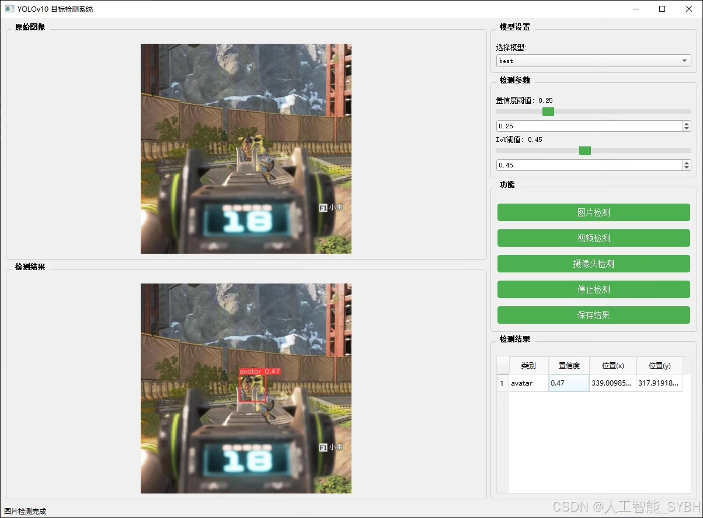
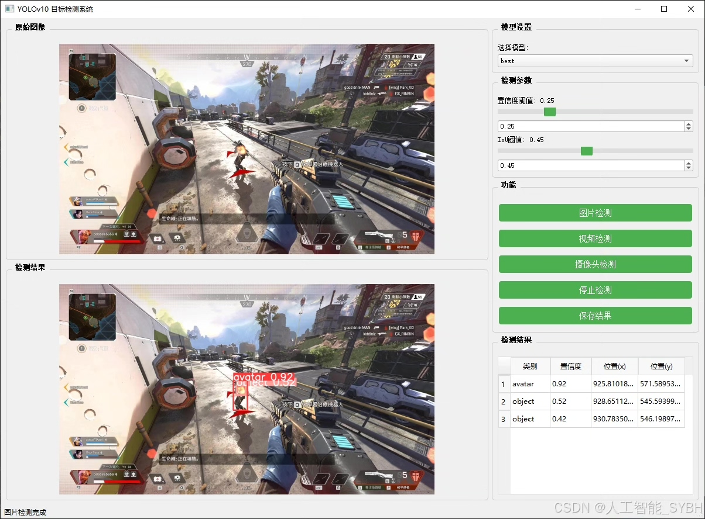
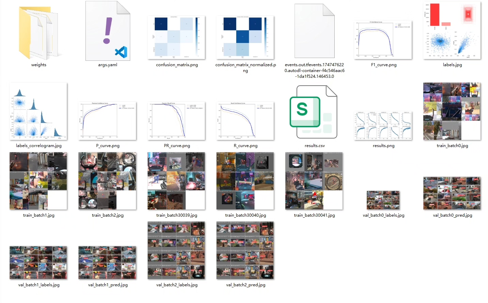
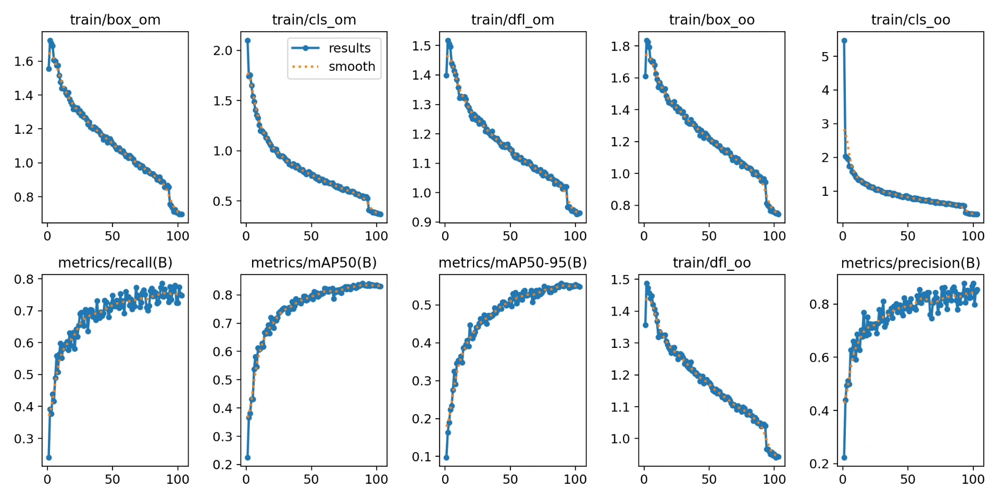
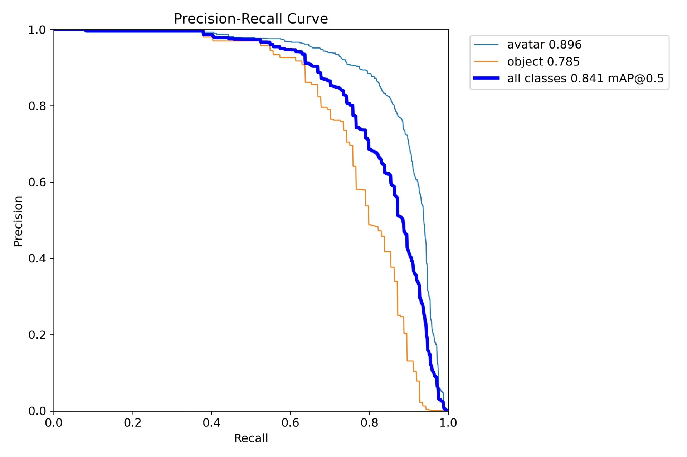
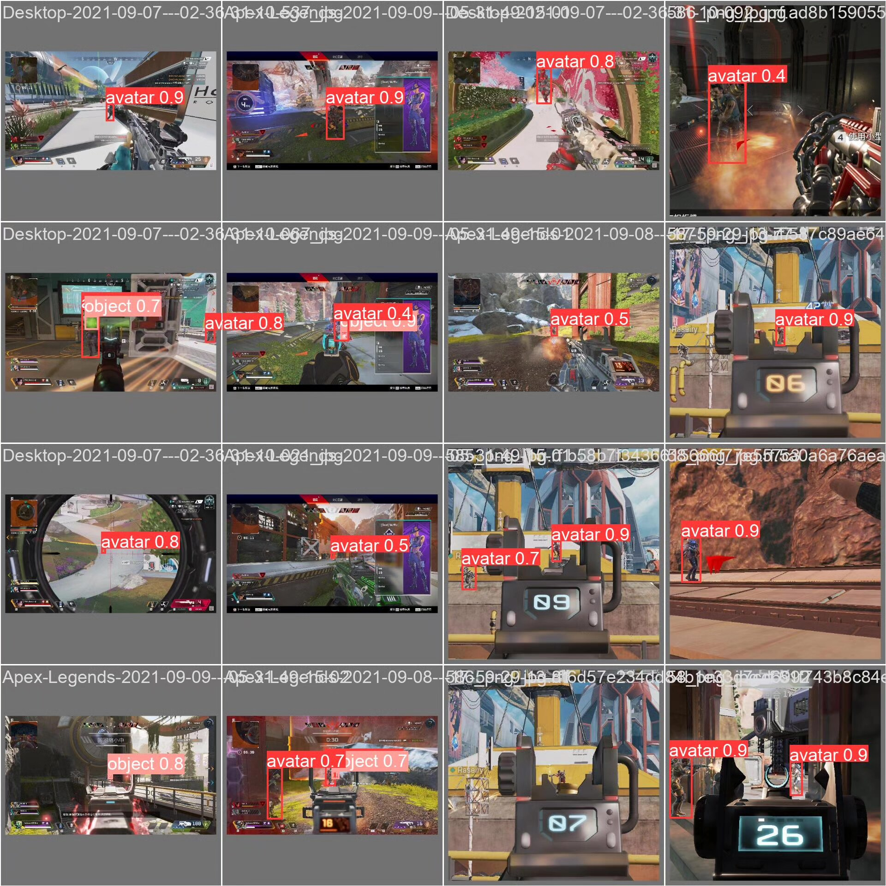
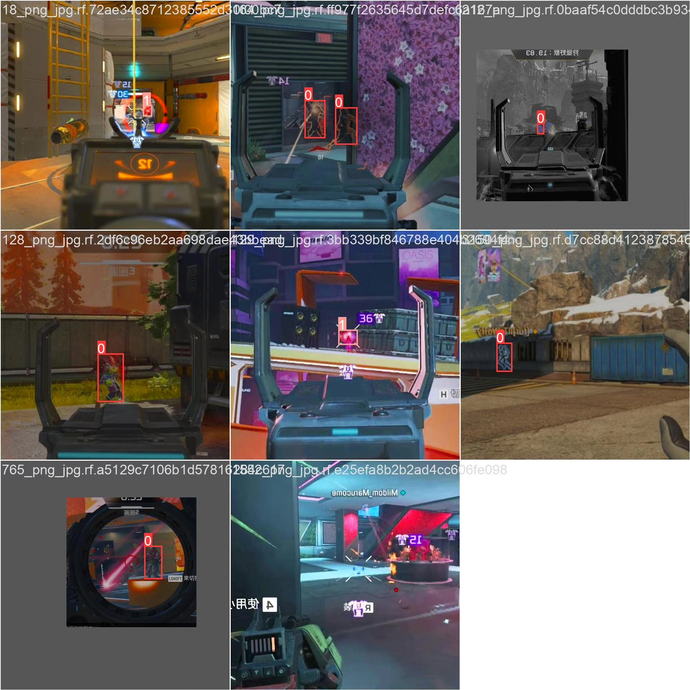
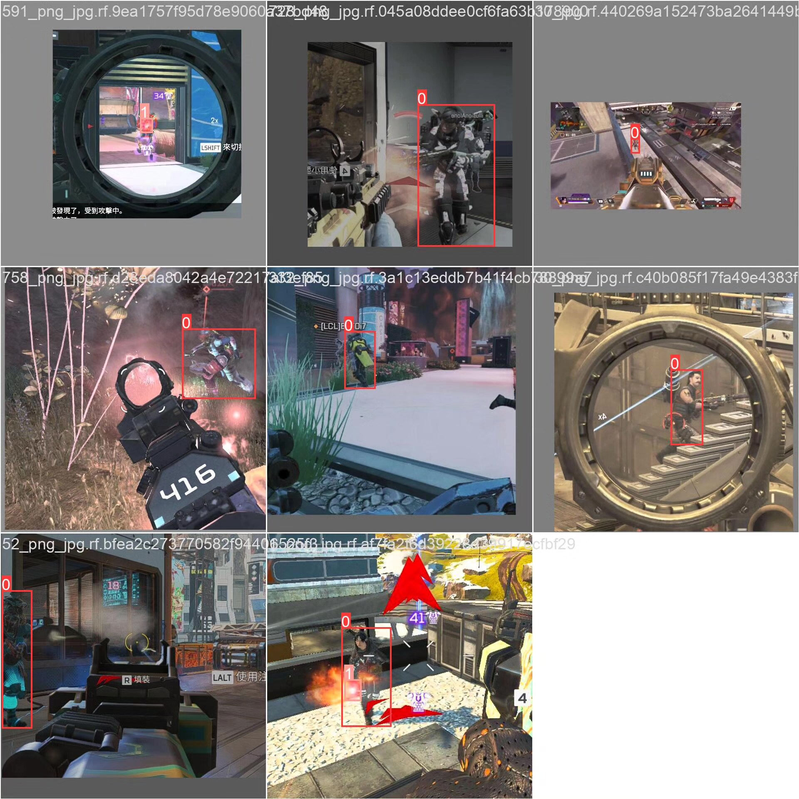

# Apex game character recognition detection system based on deep learning YOLOv10

## Body

This project is based on the YOLOv10 object detection algorithm, developing a set of specialized systems for recognizing and detecting characters and objects in the game "Apex Legends" (Apex Heroes). The system can accurately identify players' avatars and various game objects through real-time analysis of the game screen. It provides technical support for game AI development, tactical analysis, and the creation of auxiliary tools in various application scenarios. The project uses custom-collected Apex game datasets for training and validation, including 2583 training images, 691 validation images, and 415 test images, totaling 3689 labeled images. The optimized YOLOv10 model performs excellently on this dataset, meeting the needs of real-time game analysis.

The company's products have obtained the official commercial license certification from YOLO.

We provide after-sales service:

After payment, we will provide WeChat IDs to answer questions at any time.

Environment configuration: We will provide an instruction tutorial for environment configuration, and WeChat will provide answers.

Remote installation service: If you need remote configuration, an additional fee of 69 is required, with all fees refunded if the configuration fails (only refunding installation fees for older computers).

Retraining dataset: After setting up the environment, you can train on your own computer. If you need us to retrain, just pay 69 plus computing power fees (2.5 yuan/hour).

Full after-sales service

## Images

## Payment

Here is a pay link on Stripe ( https://buy.stripe.com/3cs8yP7sY87d0vu9AB ). Please contact me lonlonago@foxmail.com after funding $89, and I will send you a complete data files , thank you!

